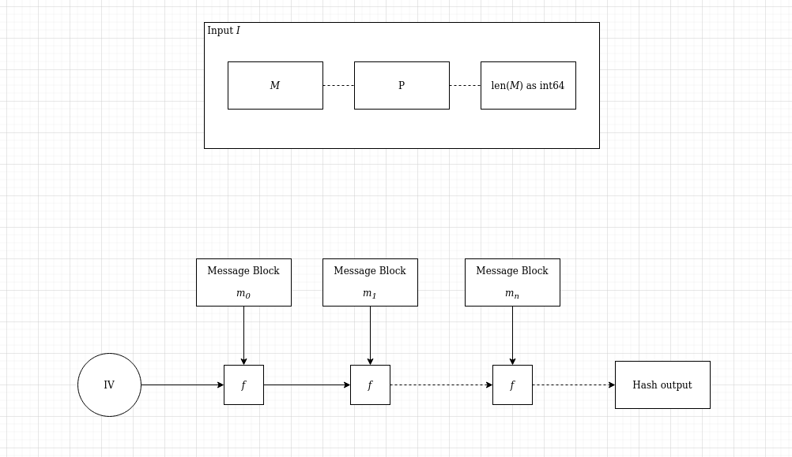

# Merkle Damgard experiment

Playing around with the merkle damgard construction.

## Specs

- Block size: 8 bytes (64 bits)
- The padding length (`p`) is `p = 8-len(M)%8` where `M` is the message to be hashed in bytes.
- The padding starts with a `1`. All other bytes are zeros.
- Additionally after the padding (`P`) has been applied to the message `M`, the length of `M` as int64 is appended to `M||P`. This results in the Input `I`. The input `I` is then split into blocks of 8 bytes since `len(I)%8 = 0` 
- The compression function `f` is xor. While this makes `f` collision resistant it also makes `f` vulnerable to second preimage attacks.
- The IV is `mdexpmnt` (8 bytes).
 
 
 
 
 ## Use
 1. `go build`
 2. `./md-experiment file.txt`